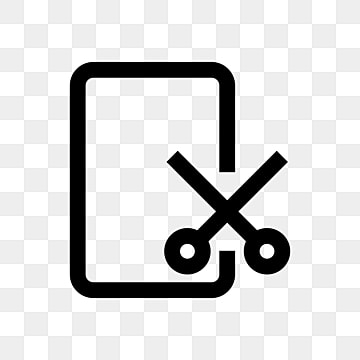

# Perfect Screenshot

<div align="center">
  
  
  **Create stunning visual designs with ease**
  
  A fully in-browser canvas editor that brings your ideas to life. Add images, text, backgrounds, and export your creations in high quality—all without external services.

  [](https://opensource.org/licenses/MIT)
  [](https://nextjs.org/)
  [](https://reactjs.org/)
  [](https://www.typescriptlang.org/)

</div>

---

## ✨ Features

### 🖼️ Image Upload & Customization
- Upload your own images seamlessly
- Customize size, opacity, borders, and shadows
- Adjust border radius for rounded corners
- Complete control over your visuals

### ✍️ Text Overlays & Backgrounds
- Add multiple text layers to your designs
- Custom fonts, colors, and text shadows
- Choose from various background options:
  - Gradient backgrounds
  - Solid colors
  - Upload custom backgrounds
  - Pre-designed background templates

### 🎨 Advanced Canvas Editor
- Drag and drop interface powered by Konva
- Real-time editing and preview
- Layer management for complex designs
- 3D perspective controls

### 📤 Professional Export
- Export as PNG with transparency support
- Adjustable quality settings
- Scale up to 5x for high-resolution output
- All processing happens in your browser
- No external services required
- Perfect for social media and professional use

### 🌐 Website Screenshot Generation
- Capture website screenshots directly
- Powered by Puppeteer for accurate rendering
- Customize and edit captured screenshots

---

## 🚀 Getting Started

### Prerequisites

Before you begin, ensure you have the following installed:
- **Node.js** (v20 or higher recommended)
- **npm** or **yarn** package manager

### Installation

1. **Clone the repository**
   ```bash
   git clone https://github.com/Rithvik1709/perfect-screenshot.git
   cd perfect-screenshot
   ```

2. **Install dependencies**
   ```bash
   npm install
   ```

3. **Set up environment variables**
   
   Create a `.env.local` file in the root directory:
   ```env
   # Supabase Configuration (if using authentication/storage)
   NEXT_PUBLIC_SUPABASE_URL=your_supabase_url
   NEXT_PUBLIC_SUPABASE_ANON_KEY=your_supabase_anon_key
   
   # Cloudinary Configuration (if using cloud storage)
   CLOUDINARY_CLOUD_NAME=your_cloud_name
   CLOUDINARY_API_KEY=your_api_key
   CLOUDINARY_API_SECRET=your_api_secret
   ```

4. **Run the development server**
   ```bash
   npm run dev
   ```

5. **Open your browser**
   
   Navigate to [http://localhost:3000](http://localhost:3000) to see the application.

---

## 📖 Usage

### Creating Your First Design

1. **Start the Editor**
   - Click "Get Started" from the landing page
   - Or navigate directly to `/home`

2. **Add Elements**
   - **Upload Image**: Drag and drop or click to upload your image
   - **Add Text**: Use the text controls to add custom text overlays
   - **Choose Background**: Select from gradients, solid colors, or upload your own

3. **Customize**
   - Adjust image properties (size, opacity, borders, shadows)
   - Modify text styles (font, color, shadow)
   - Fine-tune layout and positioning

4. **Export**
   - Choose your export quality
   - Select scale (1x to 5x)
   - Download your creation as PNG

---

## 🛠️ Tech Stack

### Frontend
- **[Next.js 16](https://nextjs.org/)** - React framework with App Router
- **[React 19](https://reactjs.org/)** - UI library
- **[TypeScript](https://www.typescriptlang.org/)** - Type safety
- **[Tailwind CSS 4](https://tailwindcss.com/)** - Utility-first CSS framework
- **[Konva](https://konvajs.org/)** & **[React Konva](https://konvajs.org/docs/react/)** - Canvas manipulation

### UI Components
- **[Radix UI](https://www.radix-ui.com/)** - Accessible component primitives
- **[Lucide React](https://lucide.dev/)** - Icon library
- **[Framer Motion](https://www.framer.com/motion/)** - Animation library

### State Management
- **[Zustand](https://github.com/pmndrs/zustand)** - Lightweight state management

### Screenshot & Rendering
- **[html2canvas](https://html2canvas.hertzen.com/)** - HTML to canvas rendering
- **[modern-screenshot](https://github.com/qq15725/modern-screenshot)** - Modern screenshot library
- **[Puppeteer](https://pptr.dev/)** - Headless browser automation

### Storage & Backend
- **[Supabase](https://supabase.com/)** - Backend as a Service
- **[Cloudinary](https://cloudinary.com/)** - Media management and CDN
- **[Next Cloudinary](https://next.cloudinary.dev/)** - Cloudinary integration for Next.js

### Validation & Forms
- **[Zod](https://zod.dev/)** - TypeScript-first schema validation
- **[React Dropzone](https://react-dropzone.js.org/)** - Drag and drop file uploads

---

## 📜 Available Scripts

### Development
```bash
npm run dev          # Start development server with webpack
npm run build        # Build production application
npm run start        # Start production server
```

### Asset Management
```bash
npm run upload-backgrounds   # Upload background assets to cloud storage
npm run upload-demo-images   # Upload demo images
npm run upload-overlays      # Upload overlay assets
npm run upload-assets        # Upload all assets
```

---

## 🏗️ Project Structure

```
perfect-screenshot/
├── app/                    # Next.js App Router
│   ├── api/               # API routes
│   ├── home/              # Editor page
│   ├── login/             # Authentication page
│   └── page.tsx           # Landing page
├── components/            # React components
│   ├── controls/          # Editor control components
│   ├── editor/            # Canvas editor components
│   ├── landing/           # Landing page components
│   └── ui/                # Reusable UI components
├── hooks/                 # Custom React hooks
├── lib/                   # Utility functions and configurations
├── types/                 # TypeScript type definitions
├── public/                # Static assets
│   ├── assets/           # General assets
│   ├── backgrounds/      # Background images
│   ├── demo/             # Demo images
│   └── overlays/         # Overlay images
└── scripts/              # Utility scripts
```

---

## 🔧 Configuration Files

- **`next.config.ts`** - Next.js configuration
- **`tailwind.config.cjs`** - Tailwind CSS configuration
- **`tsconfig.json`** - TypeScript configuration
- **`components.json`** - Shadcn UI components configuration
- **`vercel.json`** - Vercel deployment configuration

---

## 🚀 Deployment

### Deploy on Vercel

The easiest way to deploy this Next.js app is using [Vercel](https://vercel.com):

1. Push your code to GitHub
2. Import your repository on Vercel
3. Configure environment variables
4. Deploy!

[](https://vercel.com/new/clone?repository-url=https://github.com/Rithvik1709/perfect-screenshot)

### Environment Variables

Make sure to set the following environment variables in your deployment:
- `NEXT_PUBLIC_SUPABASE_URL`
- `NEXT_PUBLIC_SUPABASE_ANON_KEY`
- `CLOUDINARY_CLOUD_NAME`
- `CLOUDINARY_API_KEY`
- `CLOUDINARY_API_SECRET`

---

## 🤝 Contributing

Contributions are welcome! Please feel free to submit a Pull Request.

### How to Contribute

1. Fork the repository
2. Create your feature branch (`git checkout -b feature/AmazingFeature`)
3. Commit your changes (`git commit -m 'Add some AmazingFeature'`)
4. Push to the branch (`git push origin feature/AmazingFeature`)
5. Open a Pull Request

### Development Guidelines

- Follow the existing code style
- Write clear commit messages
- Add comments for complex logic
- Test your changes thoroughly
- Update documentation as needed

---

## 📝 License

This project is licensed under the MIT License - see the [LICENSE](LICENSE) file for details.

---

## 🙏 Acknowledgments

- Built with [Next.js](https://nextjs.org/)
- UI components from [Radix UI](https://www.radix-ui.com/)
- Icons from [Lucide](https://lucide.dev/)
- Canvas manipulation with [Konva](https://konvajs.org/)

---

## 📧 Contact

For questions or support, please open an issue on [GitHub](https://github.com/Rithvik1709/perfect-screenshot/issues).

---

<div align="center">
  Made with ❤️ by the Perfect Screenshot team
</div>
